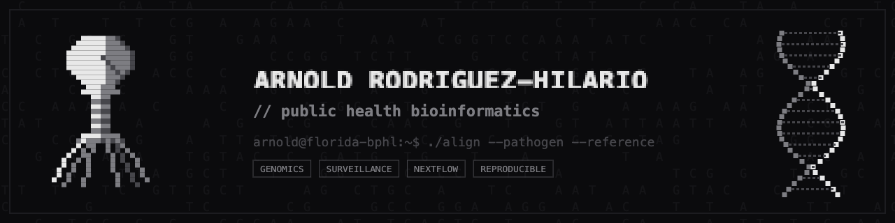

<div align="center">



<br/>

<a href="https://github.com/arodzh-sudo">
  
</a>

</div>

<br/>

```text
$ whoami
> arnold rodríguez-hilario — public health bioinformatician
> @ florida bureau of public health laboratories

$ cat ./focus.txt
> pathogen genomics ......... viral & bacterial surveillance
> genomic epidemiology ...... outbreak dynamics, evolution
> metagenomics .............. decoding microbial communities

$ ./pipeline --status
> python nextflow singularity  >  reproducible, scalable
```

<br/>

### `~/stack`


> ```
> $ ./connect --open-to "pipelines genomic epidemiology metagenomics"
> ```

<div align="center">

[](https://github.com/arodzh-sudo)

<sub>`arnold@florida-bphl:~$` <code>&#9608;</code></sub>

</div>
